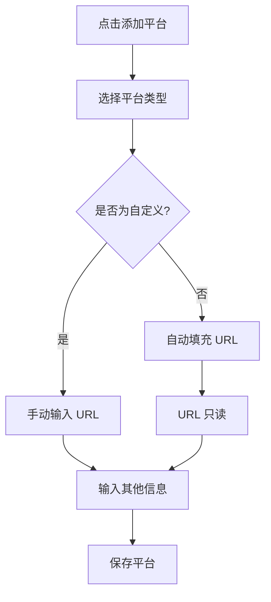
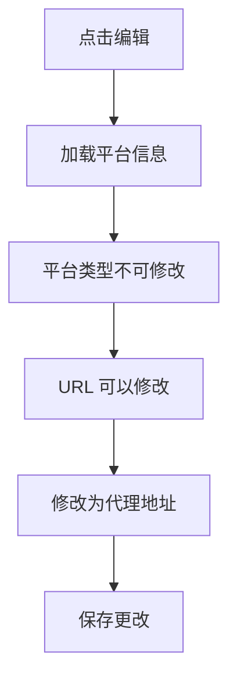

# 🔧 API 平台自动填充 URL 功能

## 更新说明

在 API 管理页面添加平台时，现在会根据选择的平台类型自动填充对应的 Base URL。

**更新时间：** 2026-04-26

---

## ✨ 新功能

### 自动填充 Base URL

当用户选择平台类型时，系统会自动填充该平台的默认 API 地址：

| 平台类型 | 自动填充的 Base URL |
|---------|-------------------|
| NVIDIA | `https://integrate.api.nvidia.com/v1` |
| OpenAI | `https://api.openai.com/v1` |
| Anthropic | `https://api.anthropic.com/v1` |
| Google AI | `https://generativelanguage.googleapis.com/v1` |
| 自定义 | 空（需要手动输入） |

### 智能提示

根据不同的状态显示不同的提示信息：

- **新建模式 + 预设平台：** "已自动填充默认 URL"
- **新建模式 + 自定义平台：** "请输入自定义 API 的 Base URL"
- **编辑模式：** "可以修改为自定义 URL"
- **未选择平台：** "选择平台类型后自动填充"

### 编辑灵活性

- **新建时：** 预设平台的 URL 不可修改（只读），确保使用正确的官方地址
- **编辑时：** 所有平台的 URL 都可以修改，支持使用代理或自定义端点

---

## 🎯 使用场景

### 场景 1：添加 NVIDIA 平台

1. 点击"➕ 添加平台"
2. 选择平台类型：`nvidia`
3. **自动填充：**
   - 显示名称：`NVIDIA API`
   - Base URL：`https://integrate.api.nvidia.com/v1`
4. 输入 API Key
5. 点击"保存"

### 场景 2：添加自定义平台

1. 点击"➕ 添加平台"
2. 选择平台类型：`custom`
3. **手动输入：**
   - 显示名称：`我的 AI 平台`
   - Base URL：`https://my-api.example.com/v1`
4. 输入 API Key
5. 点击"保存"

### 场景 3：使用代理地址

1. 添加平台后，点击"✏️"编辑
2. 修改 Base URL 为代理地址
3. 例如：`https://proxy.example.com/nvidia/v1`
4. 点击"保存"

---

## 💡 实现细节

### 平台默认配置

```javascript
const platformDefaults = {
  nvidia: {
    base_url: 'https://integrate.api.nvidia.com/v1',
    display_name: 'NVIDIA API'
  },
  openai: {
    base_url: 'https://api.openai.com/v1',
    display_name: 'OpenAI API'
  },
  anthropic: {
    base_url: 'https://api.anthropic.com/v1',
    display_name: 'Anthropic API'
  },
  google: {
    base_url: 'https://generativelanguage.googleapis.com/v1',
    display_name: 'Google AI API'
  },
  custom: {
    base_url: '',
    display_name: '自定义平台'
  }
};
```

### 自动填充逻辑

```javascript
const onPlatformTypeChange = () => {
  const platformType = platformForm.value.name;
  if (platformType && platformDefaults[platformType]) {
    const defaults = platformDefaults[platformType];
    
    // 自动填充 display_name（如果为空）
    if (!platformForm.value.display_name) {
      platformForm.value.display_name = defaults.display_name;
    }
    
    // 自动填充 base_url
    platformForm.value.base_url = defaults.base_url;
  }
};
```

### 只读控制

```javascript
const isBaseUrlReadonly = computed(() => {
  // 编辑模式下可以修改
  if (editingPlatform.value) {
    return false;
  }
  // 新建模式下，非自定义平台不可修改
  return platformForm.value.name && platformForm.value.name !== 'custom';
});
```

---

## 🎨 界面效果

### 新建平台（NVIDIA）

```
┌─────────────────────────────────────┐
│ 添加平台                            │
├─────────────────────────────────────┤
│ 平台类型 *                          │
│ [NVIDIA ▼]                          │
│                                     │
│ 显示名称 *                          │
│ [NVIDIA API]                        │
│                                     │
│ API Key                             │
│ [nvapi-xxx] [👁️]                   │
│                                     │
│ Base URL                            │
│ [https://integrate.api.nvidia...] 🔒│
│ 💡 已自动填充默认 URL               │
│                                     │
│ 描述                                │
│ [NVIDIA AI 模型平台]                │
│                                     │
│ 状态                                │
│ [启用 ▼]                            │
│                                     │
│         [取消]  [保存]              │
└─────────────────────────────────────┘
```

### 编辑平台

```
┌─────────────────────────────────────┐
│ 编辑平台                            │
├─────────────────────────────────────┤
│ 平台类型 *                          │
│ [NVIDIA] (不可修改)                 │
│                                     │
│ 显示名称 *                          │
│ [NVIDIA API]                        │
│                                     │
│ API Key                             │
│ [nvapi-xxx] [👁️]                   │
│                                     │
│ Base URL                            │
│ [https://proxy.example.com/v1]  ✏️ │
│ 💡 可以修改为自定义 URL             │
│                                     │
│ 描述                                │
│ [使用代理访问]                      │
│                                     │
│ 状态                                │
│ [启用 ▼]                            │
│                                     │
│         [取消]  [保存]              │
└─────────────────────────────────────┘
```

---

## 🔄 工作流程

### 添加新平台



### 编辑平台



---

## 📋 更新的文件

- `src/components/admin/ApiManagement.vue` - API 管理组件

### 主要更改

1. **添加平台默认配置对象**
   ```javascript
   const platformDefaults = { ... }
   ```

2. **添加自动填充函数**
   ```javascript
   const onPlatformTypeChange = () => { ... }
   ```

3. **添加只读控制**
   ```javascript
   const isBaseUrlReadonly = computed(() => { ... })
   ```

4. **添加智能提示**
   ```javascript
   const baseUrlHint = computed(() => { ... })
   ```

5. **更新表单模板**
   - 添加 `@change` 事件监听
   - 添加 `:readonly` 属性绑定
   - 添加提示文本显示

---

## ✅ 优势

### 1. 用户体验提升
- ✅ 减少手动输入
- ✅ 避免 URL 输入错误
- ✅ 提供清晰的提示

### 2. 配置准确性
- ✅ 使用官方 API 地址
- ✅ 减少配置错误
- ✅ 统一平台配置

### 3. 灵活性
- ✅ 支持自定义平台
- ✅ 编辑时可修改 URL
- ✅ 支持代理配置

---

## 🎯 最佳实践

### 推荐做法

1. **使用默认 URL**
   - 新建平台时使用自动填充的 URL
   - 确保使用官方地址

2. **需要代理时**
   - 先创建平台
   - 然后编辑修改 URL
   - 测试连接是否正常

3. **自定义平台**
   - 选择"自定义"类型
   - 输入完整的 API 地址
   - 包含协议和版本号

### 注意事项

1. **URL 格式**
   - 必须包含协议（https://）
   - 建议包含版本号（/v1）
   - 不要包含尾部斜杠

2. **代理配置**
   - 确保代理支持目标 API
   - 测试所有必需的端点
   - 注意速率限制

3. **安全性**
   - 使用 HTTPS 协议
   - 不要在 URL 中包含密钥
   - 定期更新 API Key

---

## 🔮 未来改进

- [ ] 添加 URL 验证
- [ ] 支持测试连接
- [ ] 显示 API 状态
- [ ] 支持多个 URL（主备）
- [ ] 自动检测最快节点

---

## 📚 相关文档

- [API_PLATFORM_GUIDE.md](./API_PLATFORM_GUIDE.md) - API 平台管理指南
- [API_QUICK_START.md](./API_QUICK_START.md) - 快速开始
- [API_MANAGEMENT_UPDATE.md](./API_MANAGEMENT_UPDATE.md) - 管理系统更新

---

**最后更新：** 2026-04-26  
**版本：** 1.1  
**状态：** ✅ 已实现
